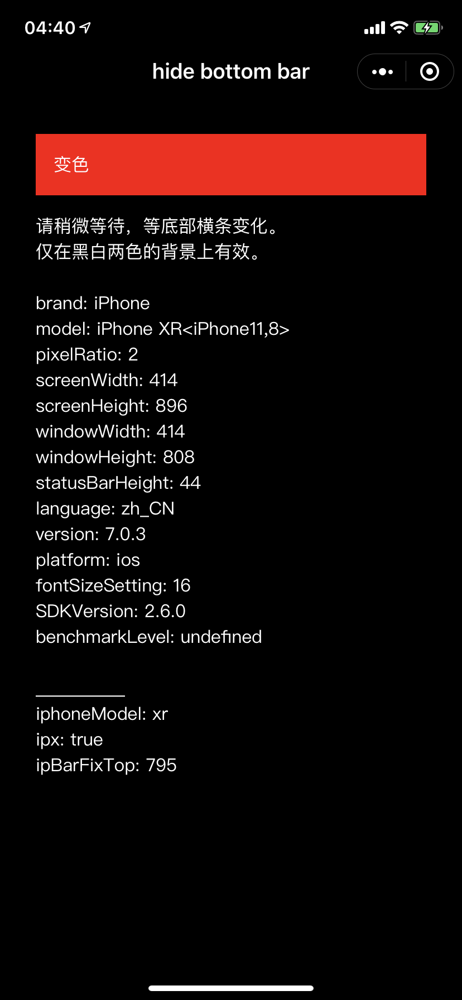
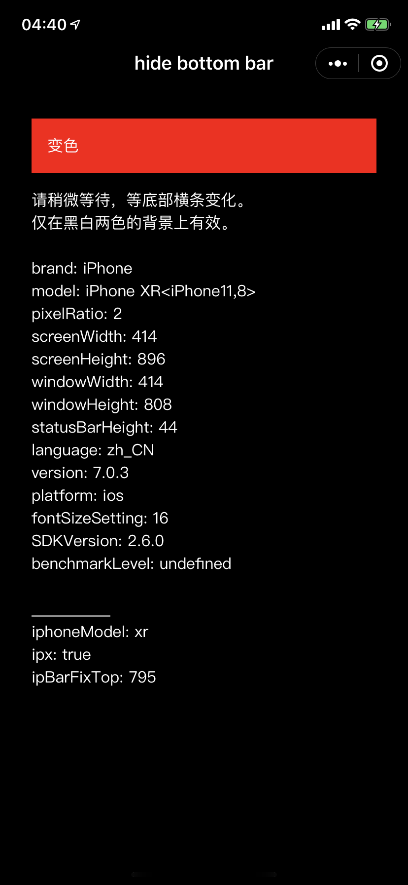
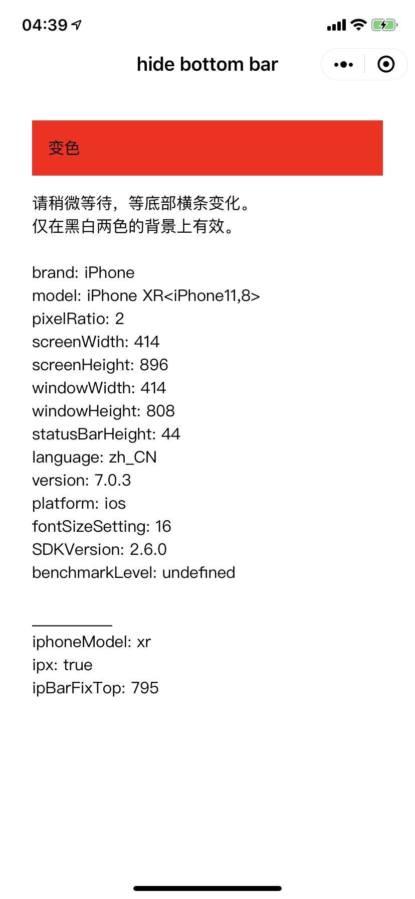
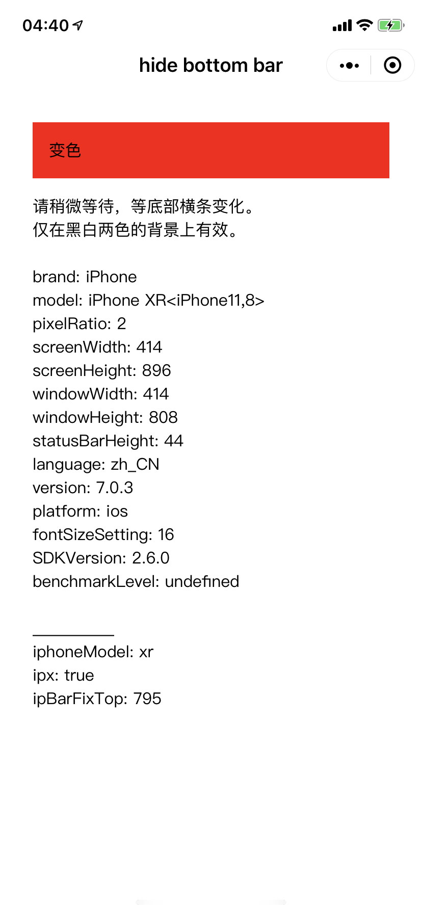

# 关于
- iphoneX 底部的系统操作条，一直保持在界面上。
- 在纯黑界面下，特别是黑色XR等机型上，底部白条非常碍眼。
- 根据背景颜色，操作条会变为黑色或白色（含毛玻璃效果）。 

# 方法
- 通过在相同位置，放置相同大小的反色横条，诱使操作条显示反色。  
    - 例：在黑色背景界面  
        On a black background.
    - 放置模拟的白色横条  
        Draw a fake white bar, same size as the system's.
    - 诱使系统横条显示黑色  
        The real bottom bar will show black(invert to white fake bar).
    - 系统横条和黑色背景融为一体  
        Now, the background and system bottom bar are both black.

# 效果图
|UI with fake bottom bar|iphone screenshot|
|:-:|:-:|
|  |  |
|  |  |

# 备注
- 白色背景下，仍能看到横条两端有少许灰色，这是毛玻璃效果造成的，暂时无解。
- 黑色背景效果好一些，但仔细看仍能看到少许破绽。
- 因为系统横条只有黑白两色，所以只能配合黑白背景。（红色背景白条）
- 真机效果参考我另一个小程序（可以切换黑色界面）  
    
